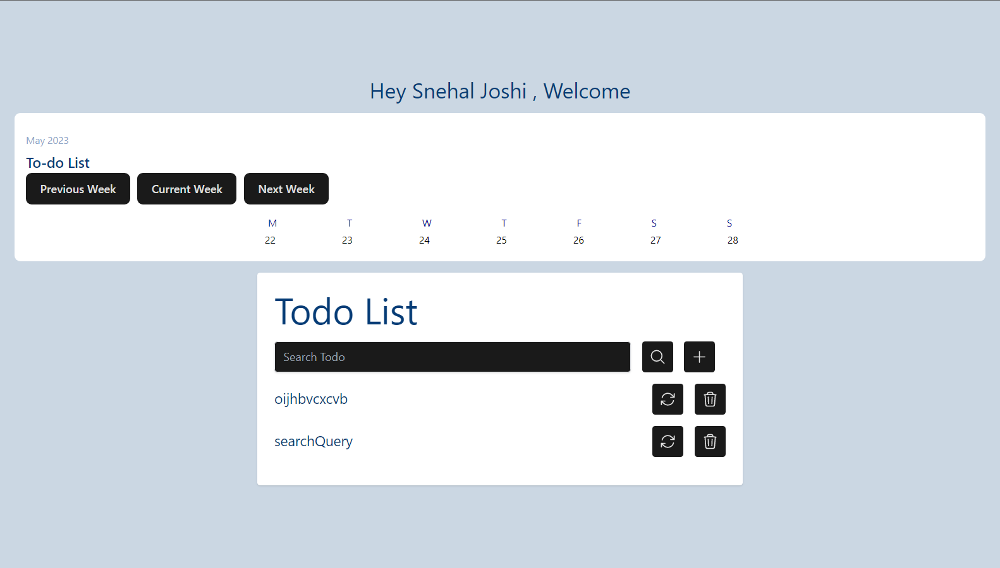

# Notes Application

The Notes Application is a web-based application that allows users to create, manage, and organize their personal notes in a convenient and efficient manner. This application utilizes various technologies to provide a seamless user experience.

## Technologies Used

- Firebase Authentication: We have integrated Firebase Authentication to handle user registration, login, and authentication. Users can log in using their Google account, which provides a secure and streamlined login process.
- Firebase Firestore: We have utilized Firebase Firestore, a NoSQL cloud database, to store and manage the notes created by users. It provides real-time synchronization, scalability, and efficient querying capabilities for managing notes.
- IndexedDB: To enhance performance and reduce dependency on constant network requests, we have implemented IndexedDB as a local cache. This allows the application to store and retrieve notes locally, providing offline access and faster retrieval of data.
- Tailwind CSS: We have employed Tailwind CSS, a utility-first CSS framework, for efficient and responsive styling of the application. Tailwind CSS provides a wide range of pre-built classes that allow us to rapidly design and customize the user interface.

## Features

- Google Popup Login: Users can log in to the application using their Google account, providing a secure and convenient authentication method.
- Note Creation: Users can create new notes by entering the title and content of the note. The application saves the notes in Firebase Firestore for easy retrieval and management.
- Note Display: The application displays the list of notes created by the user. Each note is shown with its title, content, and creation date.
- Note Deletion: Users can delete unwanted notes with a single click, allowing for efficient note management.
- Note Sorting: Notes can be sorted based on their creation date, enabling users to organize their notes chronologically.
- Future Status of Notes: In the future, we plan to implement a feature that allows users to set the status of their notes, such as "in progress," "completed," or "pending." This will provide better tracking and management of notes.
- Note Update: We plan to incorporate an update feature that allows users to modify the content and details of their existing notes.
- Search Notes: A search functionality will be implemented to enable users to search for specific notes based on keywords or other criteria.
- Responsive Design: The application is designed to be responsive and adaptable to different screen sizes, providing a seamless user experience across desktop and mobile devices.

## Installation

1. Clone the repository from GitHub.
2. Install the required dependencies using the provided package.json file.
3. Configure Firebase Authentication and Firestore by providing your Firebase project credentials.
4. Start the server and access the application through the specified URL.

## Contributing

We welcome contributions from the open-source community to enhance the Notes Application. If you'd like to contribute, please follow the guidelines outlined in the CONTRIBUTING.md file and submit a pull request with your proposed changes.

## License

The Notes Application is released under the MIT License. Please refer to the LICENSE file for more details.

## Support

For any questions, bug reports, or feature requests, please create an issue on the GitHub repository page. We appreciate your feedback and will respond to your queries as soon as possible.
